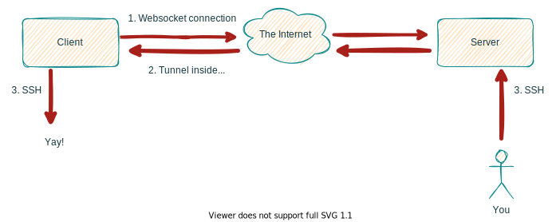

# ws-tunnel
A websocket tunnel for opening a client TCP connection from another server. You can use this when all else fails. 
It works when VPN or wireguard UDP traffic is blocked or you have a complicated NAT setup. 
The only requirement is that you can make outgoing TCP connections from the client.

## Example Setup

The client is a raspberry pi on your home network with ssh turned on. 
The requirement is to be able to ssh into the raspberry pi from anywhere in the world without having to open ports on your home router or use dynamic dns. 
Let's assume that your broadband supplier also blocks UDP traffic so wireguard doesn't work either. 
The client makes an outgoing, secure (using TLS), websocket connection to a server you control that is hosted on a virtual machine in the cloud.
In this example the server is running ubuntu and you are running nginx as a reverse proxy and to handle TLS. 
You have bought a domain, say, `example.com` and you setup nginx to route traffic from the internet to your server with a static IP. 



### Server setup

Here is an example of a simple config file called `/etc/nginx/sites-available/example.com`

```
server {
        server_name example.com;

location / {
        proxy_pass         http://127.0.0.1:5000;
        proxy_http_version 1.1;
        proxy_set_header   Upgrade $http_upgrade;
        proxy_set_header   Connection keep-alive;
        proxy_set_header   Host $host;
        proxy_cache_bypass $http_upgrade;
        proxy_set_header   X-Forwarded-For $proxy_add_x_forwarded_for;
        proxy_set_header   X-Forwarded-Proto $scheme;
    }

location /my-tunnel-endpoint {
        proxy_pass         http://127.0.0.1:5000;
        proxy_http_version 1.1;
        proxy_set_header   Upgrade $http_upgrade;
        proxy_set_header   Connection "upgrade";
    }
}

```
The config above routs all `example.com` traffic to port 5000 and for `/my-tunnel-endpoint` it sets some special headers to play nicely with the websocket protocol.
To enable the site you need to create a symbolic link as follows:
```
sudo ln -s /etc/nginx/sites-available/example.com /etc/nginx/sites-enabled/example.com
```
Given that certbot is already installed run `sudo certbot --nginx -d example.com` to obtain a certificate. 
This will update the `example.com` file accordingly. If it doesn't then something went wrong, check the default file.

Now you have to make sure the app is always running even once the machine is rebooted. 
In this example the executable `server` and its config file `server.conf` will be copied to the `/var/www/example.com` folder (this can be anywhere really).
Service config can be found in the `/etc/systemd/system` folder.

Create a file called `example.com.service` as follows:
```
[Unit]
Description=Example Websocket Server Tunnel
After=network-online.target

[Service]
WorkingDirectory=/var/www/example.com
ExecStart=/var/www/example.com/server
Restart=always
# Restart service after 10 seconds if the service crashes:
RestartSec=10
KillSignal=SIGINT
SyslogIdentifier=example.com
User=www-data
TimeoutStopSec=30

[Install]
WantedBy=network-online.target
```

Making sure your service starts automatically on boot-up
```
systemctl daemon-reload
sudo systemctl enable example.com
sudo service example.com start

# to check the server logs (live)
journalctl -u example.com.service -f
```

Set your `server.conf` file correctly:
```
{
    "ws_addr": "127.0.0.1:5000",
    "ws_path": "/my-tunnel-endpoint",
    "clients": [
        {
            "tcp_addr": "127.0.0.1:5001",
            "username": "dave",
            "password": "xxxxxxxxxxxxxxxxxxxxx"
        }
    ]
}
```


Ok you're done with the server. Now lets set up the client.

### Client Setup

Copy the built `client` binary and its config file `client.conf` to `/usr/bin/ws-tunnel`

```
[Unit]
Description=Example Websocket Client Tunnel
After=network-online.target

[Service]
WorkingDirectory=/usr/bin/ws-tunnel
ExecStart=/usr/bin/ws-tunnel/client
Restart=always
# Restart service after 10 seconds if the service crashes:
RestartSec=10
KillSignal=SIGINT
SyslogIdentifier=ws-tunnel
User=www-data
TimeoutStopSec=30

[Install]
WantedBy=network-online.target
```

Enable the client service
```
systemctl daemon-reload
sudo systemctl enable ws-tunnel
sudo service ws-tunnel start

# to check the server logs (live)
journalctl -u ws-tunnel.service -f
```

Change client settings in `client.conf` to suit your needs. Change the password at least!
Here we point the tunnel to the ssh port because that's what we want to connect to:

```
{
    "tcp_addr": "127.0.0.1:22",
    "ws_url": "wss://example.com/my-tunnel-endpoint",
    "username": "dave",
    "password": "xxxxxxxxxxxxxxxxxxxxx"
}
```

### Using the server

Now that you have set the server up you can simply ssh into your cloud server and then ssh into your client using the following command: `ssh -p 5001 dave:127.0.0.1`. You can also use something like wireguard and set firewall rules if you don't want to ssh into your server beforehand.
